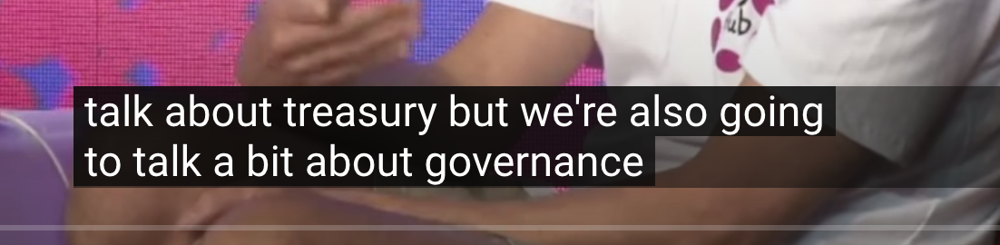
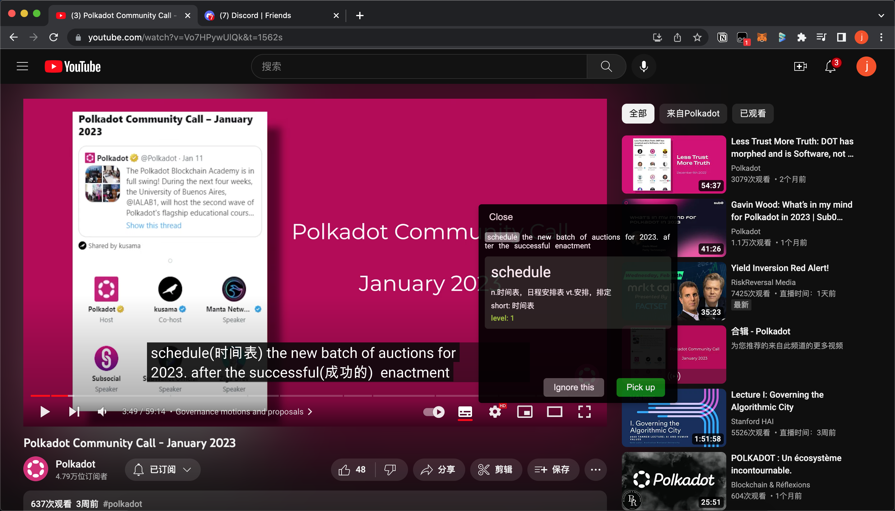

# DIWL: Project for Polkadot Europe Edition Hacks

Demo Video: https://youtu.be/KrAORm_RMA8

# Project name

The project's name is DIWL. It means Dynamic Individuation Word List.

# Target users

This dApp is mainly aimed at people with a certain level of language foundation.They already know some basic words and grammar, but their vocabulary is insufficient.

# What problem to solve

1. Build a **dynamic individuation word list**, collect new words by watching videos or browsing the web which they are interested in, translation and comment on the word they don't know, improve their foreign language skills gradually and naturally.
2. Let the foreign language beginner browse content on the Internet directly with the target language. Provides new ways to learn vocabulary and memorize words.
  
# Why use blockchain

Personalized word list is the user's private data, which is exactly the core problem to be solved by web3 technology. The data is stored on the block chain, and users can share or authorize their data, so as to further carry out some data analysis work and create more value.

# Core Functionality

Usually YouTube subtitles look like this:



When my English is not good, I don't know a certain word, for example:"treasury", I can't understand the meaning of this sentence.

So we need dictionaries.
Using a browser plug-in, we can automatically add the word's explanation to the end of the unfamiliar word, like this:


At the same time, we need to build a memorized list of words, and mark the words we already know. When we remember a word, the browser plug-in will not comment on it.

### Why Not

We can also use automatic translation, but machine translation has a lot of mistakes, and it's not good for us to improve our English.

# MVP

First, just annotate the content of one website(YouTube),  more support sites can be added later, like Medium Reddit etc.

Focusing on one use scenario allows the product to be developed quickly.

# The final completed demo




# NFT functionality will be added later

Basic functions were implemented during this hackathon due to the time (it took a lot of time on Rust),
**The NFT feature will be added later**. When users view a word, they will display a picture (NFT) to help them understand and remember the word.

**Sales of NFT encourage creators**, create quality images, help users understand and remember words, and enrich the content of the software, plan to integrate existing NFT markets, or we can implement an NFT market ourselves.

The data structure of the words in the contract, including the nft field.

```
    pub struct WordRecord {
        word: String,
        level: i32,   
        mean: String, 
        hit_count: i32,
        tag: String,
        nfts: Vec<String>,
    }
```
 

# How it work or implement

1. The list of words is stone in the smart contract, based on Ink!

2. Import the dictionary data into the smart contract. The dictionary needs to be pre-processed to grade the words.

3. Use Tampermonkey script, load the front-end code, and provide wallet login function.

4. The front-end uses polkdot.js to cache the word data in the contract to the front-end, including the following: a. Users already know and don't need to be mark's words; b. A dictionary of high-frequency words. A functional interface that provides this capability is required in the contract.

5. When the code in the browser plug-in detects that YouTube is accessed, it first checks whether real-time subtitles are enabled. If they are not enabled, no action is taken.If enabled, confirm the language is English, start to work.

6. When the conditions are met, the plug-in code periodically detects the text content in subtitles (YouTube page DOM needs to be analyzed), and matches the current word with the previous cached data. The known word is not processed, and the unknown word is now queried in the high-frequency dictionary. After finding the word explanation, modify the subtitle content and add the word explanation.

7. Modify the DIV of subtitles on the web page so that each word can be clicked. After clicking, a pop-up window can be opened to query the explanation of the word and mark the word.

8. The browser plug-in provides a page to jump to remember words, which can be reviewed and re-marked. Since the signature is required to save data into the contract, the operation data is first saved in the cache, and then synchronized.

9. Provide word list merging function, smart contract also needs to add a support function.


# Compile and run

## Build contract
build contract need to install ink: https://paritytech.github.io/ink/

> cd diwl-contract/

> cargo contract build

The contract generated by the compilation is in the following location：

>diwl-contract/target/ink/diwl_contract.contract

## Deployment contract

Running node test/deploy.js in the project root directory deploys the contract in the diwl-contract directory and prints the address of the contract.
The address is also written to the test/address_contract.txt file


## Front-end code

**The front end is also written in Rust**

> cd diwl-front-end

> trunk build

Since the wasm file cannot be loaded directly due to cross-domain issues, you need to run node read_wasm.js to put the wasm code into the js file.

### trunk.js
trunk.js in the diwl-front-end directory is copied from the dist directory by Yew compiled to initialize wasm. Some changes need to be made, and they need to be copied and modified again after each compilation.
Modify as follows:
Delete the last two lines
```
export { initSync }
export default init;
```
init function is modified to:

```
async function init(input) {
    const imports = getImports();
    initMemory(imports);

    const { instance, module } = await load(await input, imports);

    return finalizeInit(instance, module);
}
```
### polkadot.js api

The front-end code is prepared using Rust, but does not use Rust version of substrate client. Instead, polkadot.js is used, and js provides functions to interact with Wasm. Therefore, a js file needs to be compiled and placed in the diwl-front-end directory.

> cd polkadot_api

> npm run build

> ./cp.sh

### Tips

If the contract needs to be updated for recompiling, the metadata in data.js in this directory needs to be updated.
If you redeploy the contract, you also need to change the contract address defined in data.js.

The test directory does not need to be updated; it is automatically updated after recompiling.

## Local node

I'm use AstarNetwork's swanky-node for test,download a binary release from:
https://github.com/AstarNetwork/swanky-node/releases

Start local node:
>./swanky_node --dev

I use a old version macos(<12), Swanky Node binary release don't work, so I build from the source, there were some problems compiling rockdb during the compilation process.

If you have the same problem please refer to the link below:
https://github.com/rust-rocksdb/rust-rocksdb/issues/528#
https://substrate.stackexchange.com/questions/4620/build-rocksdb-failed-at-snappy-snappy-cc103336-error-invalid-output-constrai


## Initializes the word list

word_list.txt is a simple Chinese to English dictionary. Run node test/initWlist.js in the project root directory and the dictionary data will be added to the smart contract.

## Get the wordlist from the test smart contract

> cd test

> npm install

> node call.js

```
[
  { word: 'hello', level: '1', mean: '你好' },
  { word: 'hello', level: '1', mean: '你好' },
  { word: 'hello', level: '1', mean: '你好' }
]
```

## Run the local server

Run: python3 -m http.server in the diwl-front-end directory to start the local server.
The custom script in tampermonkey retrieves the js files in this directory at http://localhost:8000/.

## tampermonkey loader

diwl-front-end/tampermonkey_load.js is used to load the compiled code into the browser. After successful loading, the console prints back, obtaining the number of dictionaries and the number of user-defined words.

When you open YouTube to watch videos and open subtitles, corresponding words will be marked. After clicking subtitles, a dialog box will pop up, allowing users to ignore or mark a word.

console log
```
hello tampermonkey 1676608477724
bundle.js?v=1676608477724:2 hello lib.js
bundle.js?v=1676608477724:2 ws://localhost:9944

Hello Yew 2
trunk.js?v=1676608477724:457 <div>​Hello, World!​</div>​
trunk.js?v=1676608477724:457 common word list loaded size: 3605
bundle.js?v=1676608477724:2 getw_user
user_info.c_count,45
count,0,45

bundle.js?v=1676608477724:2 getw_user
user_info.c_count,45
start_count >= user_info.c_count

trunk.js?v=1676608477724:457 word list loaded size: 45
```

# Teamwork

I am in the process of building a web3 development online team, which will be formed from the Polkdot Hackathon. There are currently have two members Zhaojie and Clive D. More people will join in the future.

The team runs in a way like Proof Of Work(POW). For example, I have an idea, I list all the things that need to be done,  and give each thing a score. If anyone completes it, he can get the score. If the project won the Hackathon, the prize was allocated according to the score, and if the task was not completed by anyone else, it was done by myself, and the score and the prize went to me.

The name of our team is: Sidado. It's a Chinese pronunciation from Siddhartha Gautama(Sakyamuni, founder of Buddhism), it means wisdom.

I don't want to do one-off projects, develop projects that must have real value, and develop projects that are interconnected.

If you have a good idea, I suggest you do the same as me. The online team is different from the real one.

